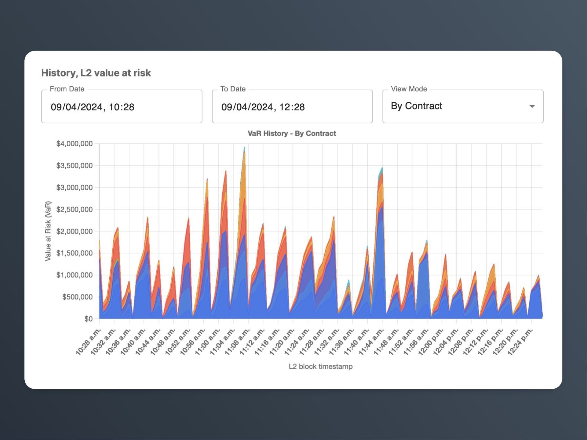

# L2 Finality

## Overview

This project is dedicated to measuring Layer 2 finality, quantifying assets at risk during each period, and monitoring past reorganizations:

- **Finality Measurement**: Accurately measures the finality of Layer 2 solutions, crucial for understanding the security and stability of L2 transactions.
- **Risk Quantification**: Quantifies the assets at risk during various periods, providing a clear picture of potential financial exposure.



### Chain Coverage
- OP Mainnet
- Starknet
- Polygon zkEVM

## Sc

## Project Structure
The L2 Finality project consists of a backend and a frontend component. For more details about each component, please refer to their respective README files:

- [Backend README](app/backend/readme.md)
- [Frontend README](app/frontend/readme.md)

## Getting Started

### Installation

1. Clone the repository:
   ```bash
   git clone https://github.com/NethermindEth/l2-finality
   ```
2. Navigate to the project directory:
   ```bash
   cd l2-finality
   ```
3. Follow the installation instructions in the [Backend README](app/backend/readme.md) and [Frontend README](app/frontend/readme.md) to set up the respective components.

### Usage

1. Start the backend server by following the instructions in the [Backend README](app/backend/readme.md).
2. Launch the frontend application by following the instructions in the [Frontend README](app/frontend/readme.md).
3. Access the L2 Finality application through your web browser.

## Contributing

We welcome contributions to the L2 Finality project! If you'd like to contribute, please follow these steps:

1. Fork the repository.
2. Create a new branch for your feature or bug fix.
3. Make your changes and commit them with descriptive commit messages.
4. Push your changes to your forked repository.
5. Submit a pull request to the main repository.

Please ensure that your code follows the project's coding conventions and includes appropriate tests.

## License

This project is licensed under an MIT License - see the [LICENSE](LICENSE) file for details.