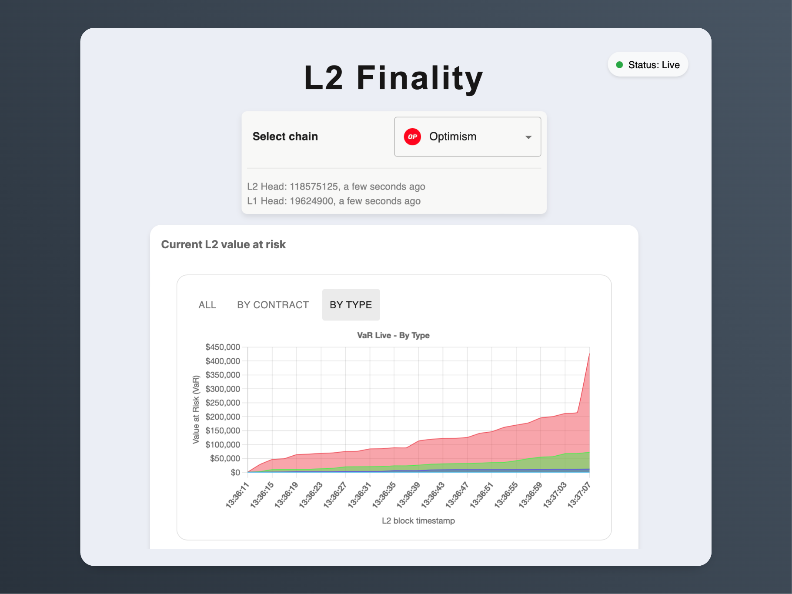
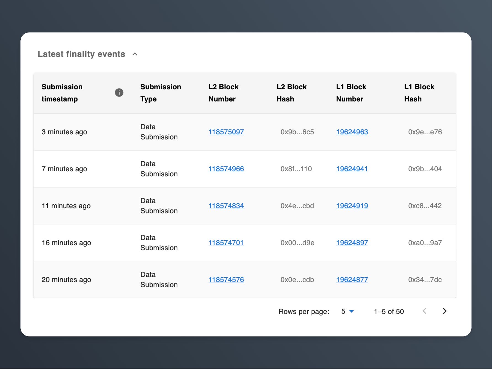
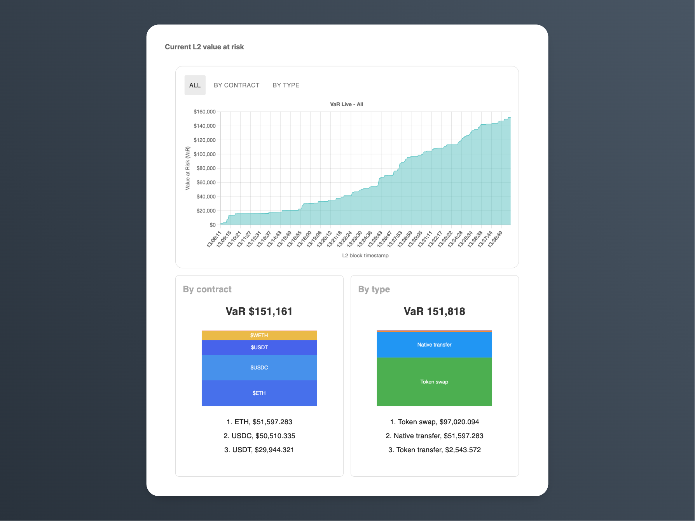

# L2 Finality Frontend

This is the frontend component of the L2 Finality project, responsible for providing a user interface to interact with the L2 finality measurements, risk quantification, and reorganization monitoring features.

## Screenshots

Here are some screenshots of the L2 Finality frontend:


*Landing page*


*The table view allows users to explore and analyze the submissions / finality events for different L2 networks.*


*The live view displays real-time l2 block value at risk for the selected L2 network.*


*The history view presents historical value at risk for the selected L2 network.*


## Getting Started

### Prerequisites

- Node.js (version X.X.X)
- npm (version X.X.X)

### Installation

1. Navigate to the frontend directory:
   ```bash
   cd app/frontend
   ```
2. Install the dependencies:
   ```bash
   npm install
   ```
3. Set up environment variables:
    - Create a `.env` file in the frontend directory.
    - Add the following variables to the `.env` file:
      ```
      BASE_URL=<backend-api-url>
      API_KEY=<your-api-key>
      ```
    - Create a `.env.local` file for any local environment-specific variables.

### Running the Frontend

1. Make sure the backend server is running. Refer to the [Backend README](../backend/readme.md) for instructions.
2. Start the frontend development server:
   ```bash
   npm start
   ```
3. Open your web browser and visit `http://localhost:3000` to access the L2 Finality frontend.

## License

This project is licensed under an MIT License - see the [LICENSE](../../LICENSE) file for details.